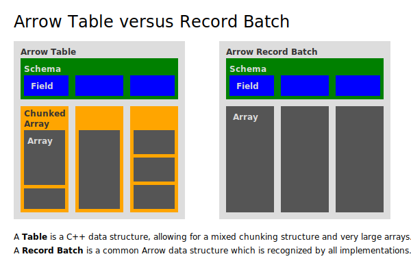

# Tabular Data

Array和Chunked Array表示相同类型的一维序列.
但是数据通常以**二维的**, **异构**数据集的形式出现.

Arrow也提供了几种抽象来方便有效德处理这些数据.


### Field

Field表示表的特定列. 一个 `arrow::Field` 包含一个数据类型, 一个字段名, 还有一些可选的元数据.

创建field的推荐方法是调用 `arrow::field()` 工厂函数.

### Schema

描述二维数据集(如表)的总体结构.

Schema保存了一系列的Field以及一些可选的元数据.

创建Schema的推荐方法是调用 `arrow::schema()` 工厂函数重载

```cpp
    // 创建一个包含两列的数据集:
    // column A: int32
    // column B: utf8 string
    std::shared_ptr<arrow::Field>  field_a;
    std::shared_ptr<arrow::Field>  field_b;
    std::shared_ptr<arrow::Schema> schema;

    field_a = arrow::field("A", arrow::int32());
    field_b = arrow::field("B", arrow::utf8());
    schema = arrow::schema({field_a, field_b});
```


### Table

`arrow::Table` 是一个二维数据集, 其中列是Chunked Array. 还有一个Schema.

每一个分块的列必须有相同的元素数量逻辑长度.
> 每一个列还是可以以不同的方式分块的


### RecordBatch

`arrow::RecordBatch` 是一个二维数据集, 包含多个连续的Array, 每一个数组的长度相同. 也有一个Schema.

RecordBatch 对于各种序列化和计算函数来说是一个方便的工作单元.




RecordBatch 可以在不同的实现之间发送, 例如通过IPC或者通过C数据接口.

Table和Chunked Array是C++实现中的概念而不是Arrow格式本身, 因此他们不能直接移植.

但是, 可以很容易将Table转换为RecordBatch, 可以容易地从RecordBatch构建表, 而不需要复制底层的数据缓冲区.

- 将Table作为多个RecordBatch处理: 使用 `arrow::TableBatchReader`
- 组装BatchRecord形成Table: 使用 `arrow::Table::FromRecordBatches()` 工厂函数重载之一
