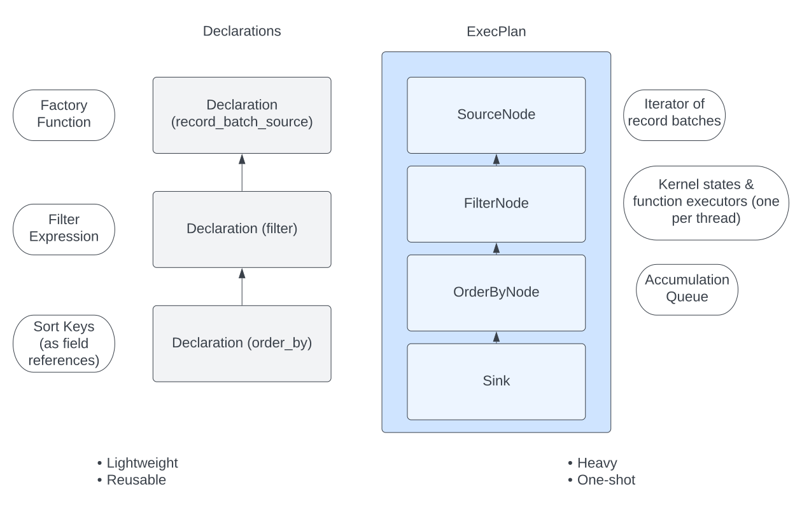

# Acero

一些复杂的计算, 直接调用计算函数在内存或者计算时间上都不可行.
Acero 可以用来制定和执行计算, 便于实现任意打的输入和更高效的资源使用.


Acero 是一个用于分析大型(可能是无限的)数据流. Acero允许将计算表示为"执行计划"(ExecPlan).

执行计算接受0或者多个输入数据流, 并输出一个数据流. 这个计划描述了数据在传递时将如何进行转换.

几个计划的例子:

- 使用公共列合并两个数据流
- 通过对照现有列计算表达式来创建额外的列
- 通过将数据流写入磁盘(分区布局)来使用数据流


Acero本身不提供分布式执行, 但是Acero 的目标是可供分布式查询执行引擎使用. (Acero 不具备将逻辑计算转换为分布式执行计划的能力)


#### Acero 与 Arrow Compute的对比

Acero处理数据流(执行查询计划并生成数据), 而 Arrow Compute处理所有数据都在内存中的情况.

#### Acero 与 Arrow C++的关系

可以将 Arrow C++分成三部分:
- Core
- Compute
- Acero

Core模块: 为Buffer和 Array 提供容器. Core不检查或者修改缓冲区的内容.

Compute模块: 在Core 之上进行了扩展, 并提供分析和转换数据的函数. Arrow 计算函数接受0个或者多个 Array/Batch/Table, 并生成一个 Array/Batch/Table. 此外, 可以将函数调用与字段引用和文本一起组合, 形成计算模块可以计算的表达式.(函数调用树), 例如: 计算`x + (y * 3)`, 给定一个包含 `x` 和 `y` 列的表.


Acero 通过添加数据流的计算操作来扩展这些功能.


> 注意: Acero不使用 Core 提供的`arrow::Table`和 `arrow::ChunkedArray`.  这是因为Acero在批处理流上运行, 因此不需要多批次数据容器. 这降低了 Acero 的复杂度.
> Acero 中经常使用`arrow::Datum`, 在Acero 中容纳的类型只有`arrow:Array`和 `arrow::Scalar`


### 核心概念

**ExecNode**

ExecNode 具有0个或者多个输入以及0或者1个输出.

- 如果ExecNode输入为0, 称其为源(source)
- 如果ExecNode没有输出, 称其为接收器(sink)

有许多不同类型的节点, 每一个节点都以不同的方式转换输入, 例子:

- Scan Node是从文件中读取数据的源节点
- Aggregate Node通过累计成批的数据来计算汇总统计信息
- Filter Node通过 filter expression从数据中删除行
- Table Sink Node将数据累加到表中

**ExecBatch**

数据批次由 ExecBatch 类表示. ExecBatch是一种2D 结构, 与RecordBatch 非常相似. 它可以有0个或者多个列, 且所有列必须具有相同的长度.

区别:


- ExecBatch没有 schema. (ExecBatch 的 schema 信息通常存储在 ExecNode 中)
- ExecBatch 中的列要么是 Array, 要么是 Scalar.
- ExecBatch包含执行计划使用的其他信息


这里四种方法表示的数据批次, 在语义上是等效的.

将 RecordBatch 转为 ExecBatch总是零拷贝的. RecordBatch和 ExecBatch 都引用完全相同的基础数组.

**ExecPlan**

ExecPlan表示 ExecNode 组成的图. 一个有效的 ExecNode 必须至少有一个源节点, 但不一定需要一个接收器节点(sink node).

ExecPlan 包含所有节点共享的资源, 并且具有控制节点启动和停止的实用功能.

ExecPlan 和 ExecNode 都与单个执行的生命周期相关联, 他们具有状态, 且不应该是可重启的.

> ExecPlan 是一个内部概念, 创建计划应该使用 Declaration 对象.
> ExecBatch也是一个内部概念, 不应该在 Acero 之外使用 ExecBatch.


**Declaration**

声明描述了需要完成的计算, 但实际上不负责执行计算. 这样一来, Declaration 就类似与一个expression.

Declaration 应该能与各种查询表示(e.g. Substrait)相互转换.

Declaration对象和 DeclarationToXyz 方法是 Acero 当前的公共 API.



Declaration 是用于实例化 ExecPlan 实例的蓝图.


### Acero 用户指南

#### 使用 Acero

Acero 的基本工作流程:

1. 首先创建一个描述计划的 Declaration 图
2. 调用 DeclarationToXyz 来执行声明
	1. 从声明图中创建新的 ExecPlan, 每个声明将对应于计划中的一个 ExecNode. 另外将添加一个接收器(Sink)节点
	2. 执行ExecPlan
	3. 计划一旦完成,  Declaration 图就会销毁

#### 创建计划

1. 使用 Substrait 创建计划

Substrait 是创建计划(声明图, graph of Declaration)的首选机制.

2. 编程方式创建计划

以编程的方式执行计划比从 Substrait 创建计划更简单, 但会失去一些灵活性和面向未来的保证. 创建 Declaration 的最简单方式是简单实例化一个, 需要声明的名称, 输入向量和选项对象. 下面是一个例子:

```cpp
// 一个 project node 示例
//
// Scan-Project-Table
// 这个示例展示了如何使用Scan操作将数据加载到执行计划中，如何将投影操作应用于数据流，以及如何将输出收集到表中
auto ScanProjectSinkExample() -> arrow::Status {
    ARROW_ASSIGN_OR_RAISE(std::shared_ptr<arrow::dataset::Dataset> dataset,
                          GetDataet());

    auto options = std::make_shared<arrow::dataset::ScanOptions>();
    // projection
    cp::Expression a_times_2
        = cp::call("multiply", {cp::field_ref("a"), cp::literal(2)});
    options->projection = cp::prinject({}, {});

    auto scan_node_options = arrow::dataset::ScanNodeOptions{dataset, options};

    ac::Declaration scan{"scan", std::move(scan_node_options)};
    ac::Declaration project{"project",
                            {std::move(scan)},
                            ac::ProjectNodeOptions({a_times_2})};

    return ExecutePlanAndCollectAsTable(std::move(project));
}
```

首先创建了一个 Scan Declaration(没有输入)和 Project Declaration(scan 作为输入).

如果是创建一个线性的声明序列,  也可以使用`Declaration::Sequence()` 函数. 上例可以改下如下:

```cpp
    // Inputs do not have to be passed to the project node when using Sequence
    ac::Declaration plan = ac::Declaration::Sequence({
        {   "scan",        std::move(scan_node_options)},
        {"project", ac::ProjectNodeOptions({a_times_2})}
    });
```

#### 执行计划

**DeclarationToTable**

`DeclarationToTable` 将所有结果累积到一个`arrow::Table` 中. 这是Acero 收集结果最简单的方法. 缺点是需要将所有结果累积到内存中.

**DeclarationToReader**

`DeclarationToReader` 可以迭代使用结果. 将会创建一个`arrow::RecordBatchReader` 对象. 这个方法可能会阻塞.

**DeclarationToStatus**

运行计划, 但不想使用结果. 在benchmark 或者计划具有副作用(如数据集写入节点)时很有用.

**直接运行计划**

DeclarationToXyz 不够用时, 可以直接运行计划. 只有当需要做一些很独特的事情时才应该这样做. 例如创建了自定义 Sink 节点, 或者需要具有多个输出的计划.

> 在现有的系统和学术文献中, 普遍假设执行计划最多只有一个输出.


#### 提供输入

执行计划的输入数据可以来自各种源.

它通常是从存储在某种文件系统上的文件中读取的.

输入来自内存中的数据也很常见.

输入也可能来自网络流, 比如Flight 请求.

Acero 支持这些情况, 而且可以支持自定义情况.


#### 可用的 ExecNode 实现

**Sources**

- source
- table_source
- record_batch_source
- record_batch_reader_source
- exec_batch_source
- array_vector_source
- scan

**Compute Nodes**

- filter
- project
- aggregate
- pivot_longer

**Arrangement Nodes(排列节点)**

- hash_join
- asofjoin
- union
- order_by
- fetch

**Sink Nodes(接收节点)**

- sink
- write
- consuming_sink
- table_sink
- order_by_sink
- select_k_sink


#### 示例

**source**

source 节点需要一个函数, 可以调用该函数来轮询获取更多的数据. 这个函数的签名应该是这样:
```cpp
auto f() -> arrow::Future<std::optional<arrow::ExecBatch>>
```

arrow 将这些函数称为`arrow::AsyncGenerator`

在开始任何处理之前, Acero必须知道执行图的每一个阶段的数据架构. 这意味着需要为源节点提供与数据本身分开的架构.

定义一个结构体来保存数据生成器定义:

```cpp
struct BatchesWithSchema {
  std::vector<cp::ExecBatch> batches;
  std::shared_ptr<arrow::Schema> schema;
  // This method uses internal arrow utilities to
  // convert a vector of record batches to an AsyncGenerator of optional batches
  arrow::AsyncGenerator<std::optional<cp::ExecBatch>> gen() const {
    auto opt_batches = ::arrow::internal::MapVector(
        [](cp::ExecBatch batch) { return std::make_optional(std::move(batch)); },
        batches);
    arrow::AsyncGenerator<std::optional<cp::ExecBatch>> gen;
    gen = arrow::MakeVectorGenerator(std::move(opt_batches));
    return gen;
  }
};
```

生成测试 batches:

```cpp
arrow::Result<BatchesWithSchema> MakeBasicBatches() {
  BatchesWithSchema out;
  auto field_vector = {arrow::field("a", arrow::int32()),
                       arrow::field("b", arrow::boolean())};
  ARROW_ASSIGN_OR_RAISE(auto b1_int, GetArrayDataSample<arrow::Int32Type>({0, 4}));
  ARROW_ASSIGN_OR_RAISE(auto b2_int, GetArrayDataSample<arrow::Int32Type>({5, 6, 7}));
  ARROW_ASSIGN_OR_RAISE(auto b3_int, GetArrayDataSample<arrow::Int32Type>({8, 9, 10}));

  ARROW_ASSIGN_OR_RAISE(auto b1_bool,
                        GetArrayDataSample<arrow::BooleanType>({false, true}));
  ARROW_ASSIGN_OR_RAISE(auto b2_bool,
                        GetArrayDataSample<arrow::BooleanType>({true, false, true}));
  ARROW_ASSIGN_OR_RAISE(auto b3_bool,
                        GetArrayDataSample<arrow::BooleanType>({false, true, false}));

  ARROW_ASSIGN_OR_RAISE(auto b1,
                        GetExecBatchFromVectors(field_vector, {b1_int, b1_bool}));
  ARROW_ASSIGN_OR_RAISE(auto b2,
                        GetExecBatchFromVectors(field_vector, {b2_int, b2_bool}));
  ARROW_ASSIGN_OR_RAISE(auto b3,
                        GetExecBatchFromVectors(field_vector, {b3_int, b3_bool}));

  out.batches = {b1, b2, b3};
  out.schema = arrow::schema(field_vector);
  return out;
}
```

使用 source 的示例:

```cpp
// 一个说明 source 和 sink 的示例
// Source-Table
// 示例展示了如何在执行计划中使用自定义源。这包括使用预生成数据的源节点并将其收集到一个表中。
//
// 这种自定义源通常是不需要的。在大多数情况下，您可以使用扫描(对于数据集源)或像table_source、array_vector_source、exec_batch_source或record_batch_source(对于内存中的数据)这样的源。
auto SourceSinkExample() -> arrow::Status {
    ARROW_ASSIGN_OR_RAISE(auto basic_data, MakeBasicBatches());
    auto source_node_options
        = ac::SourceNodeOptions{basic_data.schema, basic_data.gen()};

    ac::Declaration source{"source", std::move(source_node_options)};

    return ExecutePlanAndCollectAsTable(std::move(source));
}
```


**table_source**

如果数据已经作为 Table 存在与内存中, 则使用 TableSourceNodeOptions 会容易得多, 且性能更高.

使用 table_source 的示例:

```cpp
// 使用 table source 的示例
//
// TableSource-Table 示例
// 这个例子展示了如何在执行计划中使用table_source。这包括从表接收数据的表源节点。该计划只是将数据收集回一个表中，但也可以添加节点来修改或转换数据(之后的示例)
auto TableSourceSinkExample() -> arrow::Status {
    ARROW_ASSIGN_OR_RAISE(auto table, GetTable());
    arrow::AsyncGenerator<std::optional<cp::ExecBatch>> sink_gen;

    int  max_batch_size = 2;
    auto table_source_options
        = ac::TableSourceNodeOptions{table, max_batch_size};

    ac::Declaration source{"table_source", std::move(table_source_options)};
    return ExecutePlanAndCollectAsTable(std::move(source));
}
```

**filter**

可以使用 `arrow::compute::Expression` 编写过滤器. 表达式的返回值类型应该是布尔值.

示例: 保存 `a` 列值大于3的行.

```cpp
// 使用 filter 的示例
//
// Source-Filter-Table
// 这个例子展示了如何在执行计划中使用filter过滤数据
auto ScanFilterSinkExample() -> arrow::Status {
    ARROW_ASSIGN_OR_RAISE(std::shared_ptr<arrow::dataset::Dataset> dataset,
                          GetDataset());

    auto options = std::make_shared<arrow::dataset::ScanOptions>();
    // 指定 filter
    cp::Expression filter_expr
        = cp::greater(cp::field_ref("a"), cp::literal(3));
    // 为scanner 设置 filter: on-disk/push-down 过滤
    // 如果不是从磁盘读取, 这个步骤可以省略
    options->filter = filter_expr;
    // 空 projection
    options->projection = cp::project({}, {});

    // 构造 scan 节点
    std::cout << "Initialized Scanning Options\n";
    auto scan_node_options = arrow::dataset::ScanNodeOptions{dataset, options};
    std::cout << "Scan node options created\n";

    ac::Declaration scan{"scan", std::move(scan_node_options)};
    ac::Declaration filter{"filter",
                           {std::move(scan)},
                           ac::FilterNodeOptions(std::move(filter_expr))};

    return ExecutePlanAndCollectAsTable(std::move(filter));
}
```


**project**

投影操作会重新排列, 删除, 转换, 和创建列.

示例:

```cpp
// 使用 project 的示例
//
// Scan-Project-Table
// 这个例子展示了如何在执行计划中使用Scan加载数据, 如何在数据流上应用Project
auto ScanProjectSinkExample() -> arrow::Status {
    ARROW_ASSIGN_OR_RAISE(std::shared_ptr<arrow::dataset::Dataset> dataset,
                          GetDataset());

    auto options = std::make_shared<arrow::dataset::ScanOptions>();
    // projection
    cp::Expression a_times_2
        = cp::call("multiply", {cp::field_ref("a"), cp::literal(2)});
    options->projection = cp::project({}, {});

    auto scan_node_options = arrow::dataset::ScanNodeOptions{dataset, options};

    ac::Declaration scan{"scan", std::move(scan_node_options)};
    ac::Declaration project{"project",
                            {std::move(scan)},
                            ac::ProjectNodeOptions({a_times_2})};

    return ExecutePlanAndCollectAsTable(std::move(project));
}
```

**aggregate**

Arrow 支持两种类型的聚合: "标量"聚合和"哈希"聚合.
标量聚合将数组或标量输入减少为单个标量输出（例如，计算列的平均值）。哈希聚合的作用类似于 SQL 中的 GROUP BY，首先根据一个或多个键列对数据进行分区，然后减少每个分区中的数据。聚合节点支持这两种类型的计算，并且可以一次计算任意数量的聚合。

聚合可以以组或标量的形式提供结果。例如，像 hash_count 这样的操作将每条唯一记录的计数作为分组结果提供，而像 sum 这样的操作则提供一条记录。

标量聚合示例：

```cpp
// 使用聚合的示例
//
// Source-Aggragation-Table
// 这里示例展示如何将聚合操作应用于标量输出的执行计划。源节点加载数据，并对该数据应用聚合(对列'a'中的唯一类型进行计数)。输出被收集到一个表中(该表只有一行)。
auto SourceScalarAggregateSinkExample() -> arrow::Status {
    ARROW_ASSIGN_OR_RAISE(auto basic_data, MakeBasicBatches());
    auto source_node_options
        = ac::SourceNodeOptions{basic_data.schema, basic_data.gen()};
    ac::Declaration source{"source", std::move(source_node_options)};
    auto            aggregate_options
        = ac::AggregateNodeOptions{{{"sum", nullptr, "a", "sum(a)"}}};
    ac::Declaration aggregate{"aggregate",
                              {std::move(source)},
                              std::move(aggregate_options)};
    return ExecutePlanAndCollectAsTable(std::move(aggregate));
}

// 输出示例:
sum(a): int64
----
sum(a):
  [
    [
      49
    ]
  ]
```


组聚合(hash 聚合)示例:

```cpp
// 使用聚合执行 group-by 操作的示例
//
// Source-Aggragation-Table
// 这里示例展示如何将聚合操作应用于分组输出的执行计划。源节点加载数据，并对该数据应用聚合(对列'a'中的唯一类型进行计数)。输出被收集到一个表中，该表将为组键的每个唯一组合包含一行。
auto SourceGroupAggregateSinkExample() -> arrow::Status {
    ARROW_ASSIGN_OR_RAISE(auto basic_data, MakeBasicBatches());
    arrow::AsyncGenerator<std::optional<cp::ExecBatch>> sink_gen;

    auto source_node_options
        = ac::SourceNodeOptions{basic_data.schema, basic_data.gen()};
    ac::Declaration source{"source", std::move(source_node_options)};

    auto options
        = std::make_shared<cp::CountOptions>(cp::CountOptions::ONLY_VALID);
    auto aggregate_options
        = ac::AggregateNodeOptions{{{"hash_count", options, "a", "count(a)"}},
                                   {"b"}};

    ac::Declaration aggregate{"aggregate",
                              {std::move(source)},
                              std::move(aggregate_options)};
    return ExecutePlanAndCollectAsTable(std::move(aggregate));
}

// 输出示例:
b: bool
count(a): int64
----
b:
  [
    [
      false,
      true
    ]
  ]
count(a):
  [
    [
      4,
      4
    ]
  ]
```


**sink**

sink 操作提供输出, 而且是流式处理执行定义的最后一个节点. 与source 类似, sink算子也使用一个函数公开输出. 这个函数每次调用时都会返回一个记录批次 future. 反复调用这个函数, 直到生成器函数耗尽(返回 std::optional::nullopt)

如果这个函数调用的平率不高, 则记录批次会在内存中累积. 一个执行计划应该只有一个终止节点(一个 sink 节点)

Source Example示例也包括 Sink 操作:
```cpp
// 一个说明 source 和 sink 的示例
// Source-Table
// 示例展示了如何在执行计划中使用自定义源。这包括使用预生成数据的源节点并将其收集到一个表中。
//
// 这种自定义源通常是不需要的。在大多数情况下，您可以使用扫描(对于数据集源)或像table_source、array_vector_source、exec_batch_source或record_batch_source(对于内存中的数据)这样的源。
auto SourceSinkExample() -> arrow::Status {
    ARROW_ASSIGN_OR_RAISE(auto basic_data, MakeBasicBatches());
    auto source_node_options
        = ac::SourceNodeOptions{basic_data.schema, basic_data.gen()};

    ac::Declaration source{"source", std::move(source_node_options)};

    return ExecutePlanAndCollectAsTable(std::move(source));
}
```


**consuming_sink**

consuming_sink 算子是一个 sink 操作, 包含执行计划中的消费部分.(也就是在消费完成之前, exec plan不会完成)

与 sink节点不同, consuming_sink采用一个回调函数, 这个函数会使用批处理. 一旦回调完成, 执行计划将不在包括对批处理的任何引用.

可以在上一次调用完成之前调用使用函数. 如果消费函数的运行速度不够快, 那么许多的并发执行可能会堆积, 从而阻塞 CPU 线程池.

在完成所有消费函数回调之前, 执行计划不会被标记为已完成. 一旦所有的批次都已经提交, 执行计划将等待`finish` future完成, 然后将执行计划标记为完成. 这允许使用函数将批处理转换为异步任务的工作流.

例子:

```cpp
// 定义一个自定义的 SinkNodeConsumer
std::atomic<uint32_t> batches_seen{0};
arrow::Future<>       finish = arrow::Future<>::Make();
struct CustomSinkNodeConsumer : public arrow::acero::SinkNodeConsumer {

    CustomSinkNodeConsumer(std::atomic<uint32_t> *batches_seen,
                           arrow::Future<>        finish)
        : batches_seen(batches_seen)
        , finish(std::move(finish)) {}
    // Consumption logic can be written here
    arrow::Status Consume(cp::ExecBatch batch) override {
        // data can be consumed in the expected way
        // transfer to another system or just do some work
        // and write to disk
        (*batches_seen)++;
        return arrow::Status::OK();
    }

    auto Finish() -> arrow::Future<> override {
        return finish;
    }

    std::atomic<uint32_t> *batches_seen;
    arrow::Future<>        finish;
};
```

```cpp
// consuming sink 示例
//
// Source-Consuming-Sink
// 这个示例展示了如何通过使用ConsumingSink节点在执行计划中使用数据。这个执行计划没有数据输出
auto SourceConsumingSinkExample() -> arrow::Status {
    ARROW_ASSIGN_OR_RAISE(auto basic_data, MakeBasicBatches());

    auto source_node_options
        = ac::SourceNodeOptions{basic_data.schema, basic_data.gen()};

    ac::Declaration source{"source", std::move(source_node_options)};

    std::atomic<uint32_t> batches_seen{0};
    arrow::Future<>       finish = arrow::Future<>::Make();
    struct CustomSinkNodeConsumer : public ac::SinkNodeConsumer {
        CustomSinkNodeConsumer(std::atomic<uint32_t> *batches_seen,
                               arrow::Future<>        finish)
            : batches_seen(batches_seen)
            , finish(std::move(finish)) {}

        arrow::Status Init(const std::shared_ptr<arrow::Schema> &schema,
                           ac::BackpressureControl * /*backpressure_control*/,
                           ac::ExecPlan * /*plan*/) override {
            // This will be called as the plan is started (before the first call
            // to Consume) and provides the schema of the data coming into the
            // node, controls for pausing / resuming input, and a pointer to the
            // plan itself which can be used to access other utilities such as
            // the thread indexer or async task scheduler.
            return arrow::Status::OK();
        }

        arrow::Status Consume(cp::ExecBatch batch) override {
            (*batches_seen)++;
            return arrow::Status::OK();
        }

        auto Finish() -> arrow::Future<> override {
            // Here you can perform whatever (possibly async) cleanup is needed,
            // e.g. closing output file handles and flushing remaining work
            return arrow::Future<>::MakeFinished();
        }

        std::atomic<uint32_t> *batches_seen;
        arrow::Future<>        finish;
    };
    std::shared_ptr<CustomSinkNodeConsumer> consumer
        = std::make_shared<CustomSinkNodeConsumer>(&batches_seen, finish);

    ac::Declaration consuming_sink{
        "consuming_sink",
        {std::move(source)},
        ac::ConsumingSinkNodeOptions(std::move(consumer))};

    // Since we are consuming the data within the plan there is no output and we
    // simply run the plan to completion instead of collecting into a table.
    ARROW_RETURN_NOT_OK(ac::DeclarationToStatus(std::move(consuming_sink)));

    std::cout << "The consuming sink node saw " << batches_seen.load()
              << " batches\n";
    return arrow::Status::OK();
}
```

**order_by_sink**

是 sink 操作的扩展

Order-By-Sink 示例:

```cpp
auto ExecutePlanAndCollectAsTableWithCustomSink(
    const std::shared_ptr<ac::ExecPlan>                &plan,
    std::shared_ptr<arrow::Schema>                      schema,
    arrow::AsyncGenerator<std::optional<cp::ExecBatch>> sink_gen)
    -> arrow::Status {
    // translate sink_gen (async) to sink_reader (sync)
    std::shared_ptr<arrow::RecordBatchReader> sink_reader
        = ac::MakeGeneratorReader(std::move(schema),
                                  std::move(sink_gen),
                                  arrow::default_memory_pool());

    // validate the ExecPlan
    ARROW_RETURN_NOT_OK(plan->Validate());
    std::cout << "ExecPlan created : " << plan->ToString() << '\n';
    // start the ExecPlan
    plan->StartProducing();

    // collect sink_reader into a Table
    std::shared_ptr<arrow::Table> response_table;

    ARROW_ASSIGN_OR_RAISE(
        response_table,
        arrow::Table::FromRecordBatchReader(sink_reader.get()));

    std::cout << "Results : " << response_table->ToString() << '\n';

    // stop producing
    plan->StopProducing();
    // plan mark finished
    auto future = plan->finished();
    return future.status();
}

/// order-by 示例
///
/// Source-OrderBy-Sink
/// 数据通过源节点进入，数据在sink节点中排序。顺序可以是ASCENDING或DESCENDING，并且是可配置的。输出以表的形式从sink节点获得。
auto SourceOrderBySinkExample() -> arrow::Status {
    ARROW_ASSIGN_OR_RAISE(std::shared_ptr<ac::ExecPlan> plan,
                          ac::ExecPlan::Make(*cp::threaded_exec_context()));

    ARROW_ASSIGN_OR_RAISE(auto basic_data, MakeSortTestBasicBatches());

    arrow::AsyncGenerator<std::optional<cp::ExecBatch>> sink_gen;

    auto source_node_options
        = ac::SourceNodeOptions{basic_data.schema, basic_data.gen()};
    ARROW_ASSIGN_OR_RAISE(
        ac::ExecNode * source,
        ac::MakeExecNode("source", plan.get(), {}, source_node_options));

    ARROW_RETURN_NOT_OK(ac::MakeExecNode(
        "order_by_sink",
        plan.get(),
        {source},
        ac::OrderBySinkNodeOptions{
            cp::SortOptions{{cp::SortKey{"a", cp::SortOrder::Descending}}},
            &sink_gen}));

    return ExecutePlanAndCollectAsTableWithCustomSink(plan,
                                                      basic_data.schema,
                                                      sink_gen);
}
```


**select_k_sink**

选择 top/bottom K个元素. 类似于SQL `ORDER BY ... LIMIT K` 子句.

Select K 示例:
```cpp
// select-k 示例
//
// Source-KSelect
// 这个例子展示了如何从顶部或底部选择K个元素。输出节点是一个修改后的sink节点，其中的输出可以以表的形式获得。
auto SourceKSelectExample() -> arrow::Status {
    ARROW_ASSIGN_OR_RAISE(auto input, MakeGroupableBatches());
    ARROW_ASSIGN_OR_RAISE(std::shared_ptr<ac::ExecPlan> plan,
                          ac::ExecPlan::Make(*cp::threaded_exec_context()));
    arrow::AsyncGenerator<std::optional<cp::ExecBatch>> sink_gen;

    ARROW_ASSIGN_OR_RAISE(
        ac::ExecNode * source,
        ac::MakeExecNode("source",
                         plan.get(),
                         {},
                         ac::SourceNodeOptions{input.schema, input.gen()}));

    cp::SelectKOptions options
        = cp::SelectKOptions::TopKDefault(/*k=*/2, {"i32"});

    ARROW_RETURN_NOT_OK(
        ac::MakeExecNode("select_k_sink",
                         plan.get(),
                         {source},
                         ac::SelectKSinkNodeOptions{options, &sink_gen}));

    auto schema = arrow::schema({arrow::field("i32", arrow::int32()),
                                 arrow::field("str", arrow::utf8())});

    return ExecutePlanAndCollectAsTableWithCustomSink(plan, schema, sink_gen);
}
```


**table_sink**

提供将输出作为内存中的表接收的功能. 只有输出适合放到内存才有意义.

示例:

```cpp
// table sink 示例
//
// 在执行计划中使用 table_sink 的示例, 包括一个 source 节点接收数据作为 batches
// 和 Table sink 节点提交输出到一个 table
auto TableSinkExample() -> arrow::Status {
    ARROW_ASSIGN_OR_RAISE(std::shared_ptr<ac::ExecPlan> plan,
                          ac::ExecPlan::Make(*cp::threaded_exec_context()));

    ARROW_ASSIGN_OR_RAISE(auto basic_data, MakeBasicBatches());

    auto source_node_options
        = ac::SourceNodeOptions{basic_data.schema, basic_data.gen()};

    ARROW_ASSIGN_OR_RAISE(
        ac::ExecNode * source,
        ac::MakeExecNode("source", plan.get(), {}, source_node_options));

    std::shared_ptr<arrow::Table> output_table;
    auto table_sink_options = ac::TableSinkNodeOptions{&output_table};

    ARROW_RETURN_NOT_OK(ac::MakeExecNode("table_sink",
                                         plan.get(),
                                         {source},
                                         table_sink_options));
    // validate the ExecPlan
    ARROW_RETURN_NOT_OK(plan->Validate());
    std::cout << "ExecPlan created : " << plan->ToString() << '\n';
    // start the ExecPlan
    plan->StartProducing();

    // Wait for the plan to finish
    auto finished = plan->finished();
    RETURN_NOT_OK(finished.status());
    std::cout << "Results : " << output_table->ToString() << '\n';
    return arrow::Status::OK();
}
```


**scan**

用于加载和处理数据集. 当输入是数据集时, 应该更优先使用`scan` 而不是更通用的`source`

scan 节点能够应用下推过滤器到文件读取器, 从而减少需要读取的数据量. 这意味这可以向扫描节点提供相同的筛选表达式, 因为筛选是在两个不同的位置完成的.

scan 示例:

```cpp
// scan 和 sink 的示例
//
// Scan-Table
// 展示如何在数据集上应用扫描操作, 有一些操作可以应用扫描(project, filter). 输出 table
auto ScanSinkExample() -> arrow::Status {
    ARROW_ASSIGN_OR_RAISE(std::shared_ptr<arrow::dataset::Dataset> dataset,
                          GetDataset());
    auto options = std::make_shared<arrow::dataset::ScanOptions>();
    options->projection = cp::project({}, {});

    // 构造 scan 节点
    auto scan_node_options = arrow::dataset::ScanNodeOptions{dataset, options};
    ac::Declaration scan{"scan", std::move(scan_node_options)};

    return ExecutePlanAndCollectAsTable(std::move(scan));
}
```

**write**

write节点使用 Arrow 中的`Tabular Datasets` 功能, 将查询结果保存为 Parquet, Feather, CSV等格式的文件数据集.

write 示例:

```cpp
/// \brief An example showing a write node
/// \param file_path The destination to write to
///
/// Scan-Filter-Write
/// This example shows how scan node can be used to load the data
/// and after processing how it can be written to disk.
auto ScanFilterWriteExample(const std::string &file_path) -> arrow::Status {
    ARROW_ASSIGN_OR_RAISE(std::shared_ptr<arrow::dataset::Dataset> dataset,
                          GetDataset());

    auto options = std::make_shared<arrow::dataset::ScanOptions>();
    // empty projection
    options->projection = cp::project({}, {});

    auto scan_node_options = arrow::dataset::ScanNodeOptions{dataset, options};

    ac::Declaration scan{"scan", std::move(scan_node_options)};

    arrow::AsyncGenerator<std::optional<cp::ExecBatch>> sink_gen;

    std::string root_path;
    std::string uri = "file://" + file_path;
    ARROW_ASSIGN_OR_RAISE(std::shared_ptr<arrow::fs::FileSystem> filesystem,
                          arrow::fs::FileSystemFromUri(uri, &root_path));

    auto base_path = root_path + "/parquet_dataset";
    // Uncomment the following line, if run repeatedly
    // ARROW_RETURN_NOT_OK(filesystem->DeleteDirContents(base_path));
    ARROW_RETURN_NOT_OK(filesystem->CreateDir(base_path));

    // The partition schema determines which fields are part of the
    // partitioning.
    auto partition_schema = arrow::schema({arrow::field("a", arrow::int32())});
    // We'll use Hive-style partitioning,
    // which creates directories with "key=value" pairs.

    auto partitioning
        = std::make_shared<arrow::dataset::HivePartitioning>(partition_schema);
    // We'll write Parquet files.
    auto format = std::make_shared<arrow::dataset::ParquetFileFormat>();

    arrow::dataset::FileSystemDatasetWriteOptions write_options;
    write_options.file_write_options = format->DefaultWriteOptions();
    write_options.filesystem = filesystem;
    write_options.base_dir = base_path;
    write_options.partitioning = partitioning;
    write_options.basename_template = "part{i}.parquet";

    arrow::dataset::WriteNodeOptions write_node_options{write_options};

    ac::Declaration write{"write",
                          {std::move(scan)},
                          std::move(write_node_options)};

    // Since the write node has no output we simply run the plan to completion
    // and the data should be written
    ARROW_RETURN_NOT_OK(ac::DeclarationToStatus(std::move(write)));

    std::cout << "Dataset written to " << base_path << '\n';
    return arrow::Status::OK();
}
```


**union**

将具有相同 schema 的多个数据流合并为一个. 类似于SQL `UNION ALL` 子句.

union 示例:

```cpp
// union 示例
//
// Source-Union-Table
// 展示两个数据源的 union 操作, 输出到一个 table 中
auto SourceUnionSinkExample() -> arrow::Status {
    ARROW_ASSIGN_OR_RAISE(auto basic_data, MakeBasicBatches());
    ac::Declaration left{
        "source",
        ac::SourceNodeOptions{basic_data.schema, basic_data.gen()}
    };
    left.label = "left";
    ac::Declaration right{
        "source",
        ac::SourceNodeOptions{basic_data.schema, basic_data.gen()}
    };
    right.label = "right";

    ac::Declaration union_plan{
        "union",
        {std::move(left), std::move(right)},
        ac::ExecNodeOptions{}
    };

    return ExecutePlanAndCollectAsTable(std::move(union_plan));
}
```


**hash_join**

使用基于 hash的算法进行连接.

示例:

```cpp

// hash join 示例
//
// Source-HashJoin-Table
// 展示 souce 节点获取数据, 对数据执行 self-join, 输出到 table
auto SourceHashJoinSinkExample() -> arrow::Status {
    ARROW_ASSIGN_OR_RAISE(auto input, MakeGroupableBatches());

    ac::Declaration left{
        "source",
        ac::SourceNodeOptions{input.schema, input.gen()}
    };
    ac::Declaration right{
        "source",
        ac::SourceNodeOptions{input.schema, input.gen()}
    };

    ac::HashJoinNodeOptions join_opts{
        ac::JoinType::INNER,
        /*left_keys=*/{"str"},
        /*right_keys=*/{"str"},
        cp::literal(true),
        "l_",
        "r_"};

    ac::Declaration hashjoin{
        "hashjoin",
        {std::move(left), std::move(right)},
        std::move(join_opts)
    };

    return ExecutePlanAndCollectAsTable(std::move(hashjoin));
}
```
