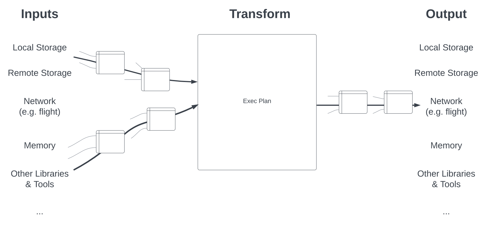
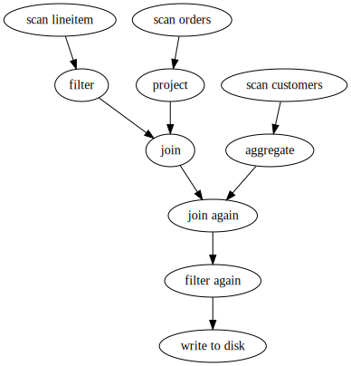
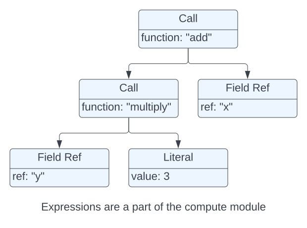
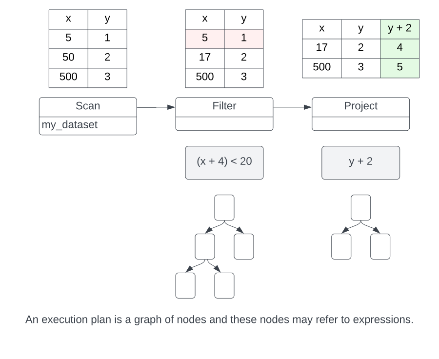
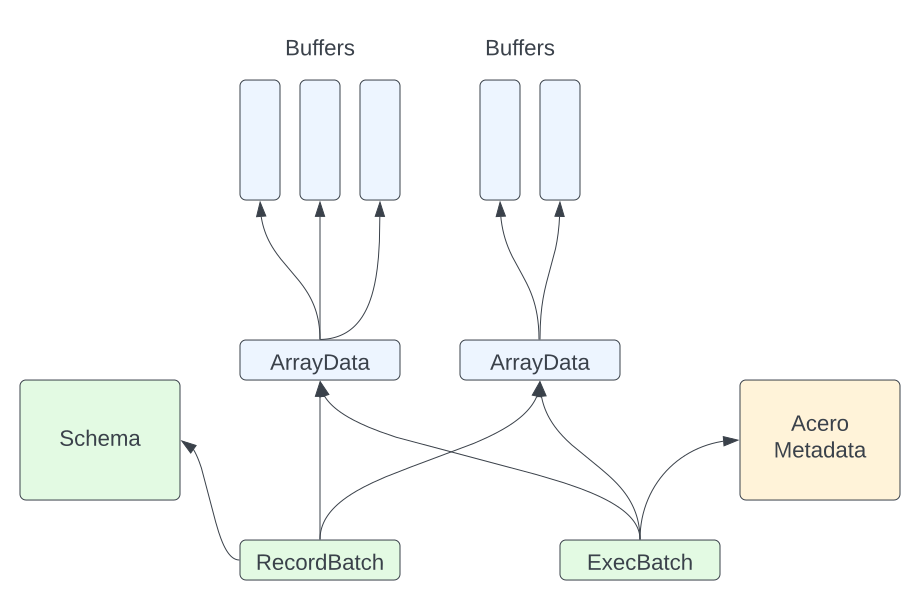
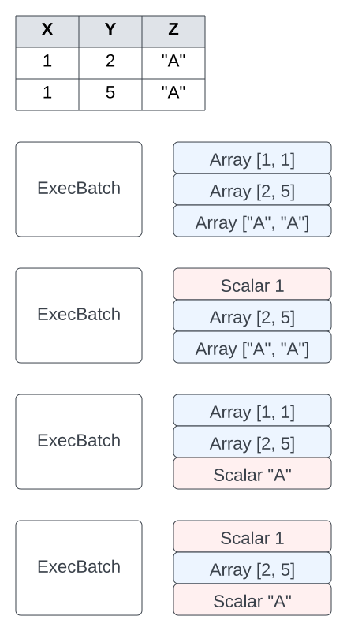

# Acero

一些复杂的计算, 直接调用计算函数在内存或者计算时间上都不可行.
Acero 可以用来制定和执行计算, 便于实现任意打的输入和更高效的资源使用.

Acero 是一个用于分析大型(可能是无限的)数据流. Acero允许将计算表示为"执行计划"(ExecPlan).

执行计算接受0或者多个输入数据流, 并输出一个数据流. 这个计划描述了数据在传递时将如何进行转换.

几个计划的例子:

- 使用公共列合并两个数据流
- 通过对照现有列计算表达式来创建额外的列
- 通过将数据流写入磁盘(分区布局)来使用数据流

Acero本身不提供分布式执行, 但是Acero 的目标是可供分布式查询执行引擎使用. (Acero 不具备将逻辑计算转换为分布式执行计划的能力)

#### Acero 与 Arrow Compute的对比

Acero处理数据流(执行查询计划并生成数据), 而 Arrow Compute处理所有数据都在内存中的情况.

#### Acero 与 Arrow C++的关系

可以将 Arrow C++分成三部分:
- Core
- Compute
- Acero

Core模块: 为Buffer和 Array 提供容器. Core不检查或者修改缓冲区的内容.

Compute模块: 在Core 之上进行了扩展, 并提供分析和转换数据的函数. Arrow 计算函数接受0个或者多个 Array/Batch/Table, 并生成一个 Array/Batch/Table. 此外, 可以将函数调用与字段引用和文本一起组合, 形成计算模块可以计算的表达式.(函数调用树), 例如: 计算`x + (y * 3)`, 给定一个包含 `x` 和 `y` 列的表.

Acero 通过添加数据流的计算操作来扩展这些功能.

> 注意: Acero不使用 Core 提供的`arrow::Table`和 `arrow::ChunkedArray`.  这是因为Acero在批处理流上运行, 因此不需要多批次数据容器. 这降低了 Acero 的复杂度.
> Acero 中经常使用`arrow::Datum`, 在Acero 中容纳的类型只有`arrow:Array`和 `arrow::Scalar`

### 核心概念

**ExecNode**

ExecNode 具有0个或者多个输入以及0或者1个输出.

- 如果ExecNode输入为0, 称其为源(source)
- 如果ExecNode没有输出, 称其为接收器(sink)

有许多不同类型的节点, 每一个节点都以不同的方式转换输入, 例子:

- Scan Node是从文件中读取数据的源节点
- Aggregate Node通过累计成批的数据来计算汇总统计信息
- Filter Node通过 filter expression从数据中删除行
- Table Sink Node将数据累加到表中

**ExecBatch**

数据批次由 ExecBatch 类表示. ExecBatch是一种2D 结构, 与RecordBatch 非常相似. 它可以有0个或者多个列, 且所有列必须具有相同的长度.

区别:

- ExecBatch没有 schema. (ExecBatch 的 schema 信息通常存储在 ExecNode 中)
- ExecBatch 中的列要么是 Array, 要么是 Scalar.
- ExecBatch包含执行计划使用的其他信息

这里四种方法表示的数据批次, 在语义上是等效的.

将 RecordBatch 转为 ExecBatch总是零拷贝的. RecordBatch和 ExecBatch 都引用完全相同的基础数组.
